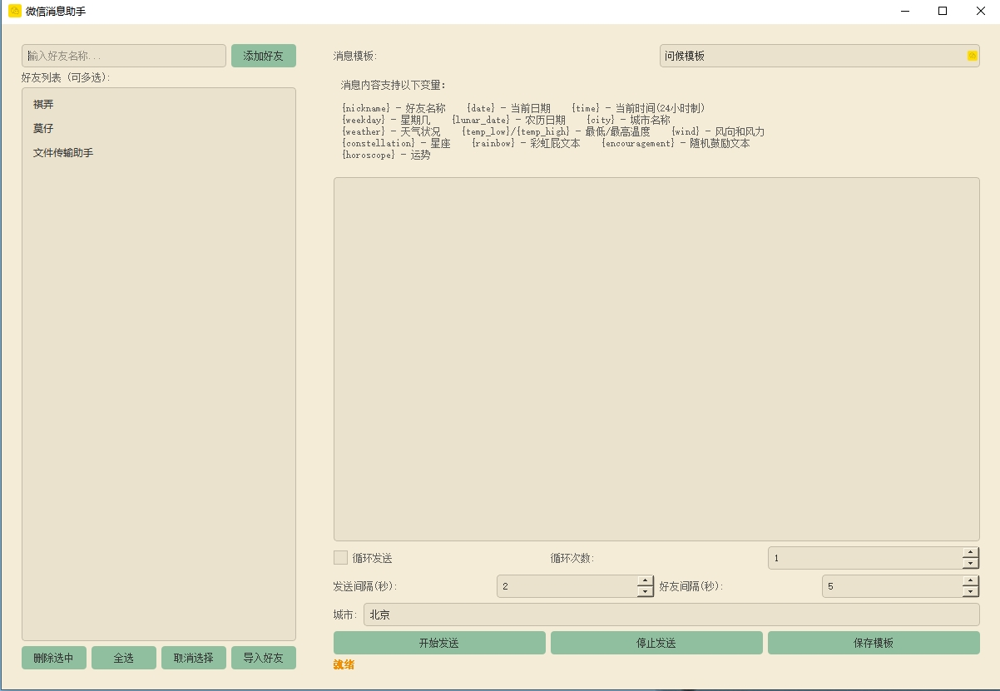

# 微信消息助手

## 项目简介
微信消息助手是一个基于 PyQt5 开发的桌面应用程序，用于自动化发送微信消息。它支持多种消息模板、变量替换、定时发送和循环发送等功能，可以帮助用户轻松管理和发送个性化消息。

## 界面预览


## 目录结构
```
Demo012/
├── main.py                 # 程序入口文件
├── build.py               # 打包脚本
├── requirements.txt       # 依赖包列表
├── README.md             # 项目说明文档
├── config/               # 配置文件目录
│   ├── friends.json     # 好友列表配置
│   └── encouragements.txt # 鼓励文本配置
├── images/              # 图片资源目录
│   └── down-arrow.png   # 程序图标
├── ui/                  # 界面相关代码
│   ├── main_window.py   # 主窗口实现
│   └── 001.png         # 界面预览图
└── utils/              # 工具类目录
    ├── wechat_controller.py  # 微信控制器
    └── message_handler.py    # 消息处理器
```

## 功能特性

### 1. 好友管理
- 添加/删除好友
- 批量导入好友列表（支持 txt 和 json 格式）
- 一键全选/取消选择好友
- 好友列表持久化存储
- 支持从文件导入好友列表

### 2. 消息模板系统
- 支持保存和加载消息模板
- 丰富的变量替换功能
- 实时预览消息内容
- 模板持久化存储

### 3. 发送控制
- 单次发送/循环发送
- 自定义发送间隔时间（1-3600秒）
- 自定义好友间隔时间（1-3600秒）
- 发送进度实时显示
- 支持随时停止发送
- 发送状态详细展示

### 4. 变量系统
支持以下动态变量：
- `{nickname}` - 好友名称
- `{date}` - 当前日期
- `{time}` - 当前时间(24小时制)
- `{weekday}` - 星期几
- `{lunar_date}` - 农历日期
- `{city}` - 城市名称
- `{weather}` - 天气状况
- `{temp_low}/{temp_high}` - 最低/最高温度
- `{wind}` - 风向和风力
- `{constellation}` - 星座
- `{rainbow}` - 彩虹屁文本
- `{encouragement}` - 随机鼓励文本
- `{horoscope}` - 运势

### 5. 天气功能
- 支持全国城市天气查询
- 提供详细天气信息
- 天气数据自动缓存
- 支持自动更新

### 6. 界面特性
- 现代化界面设计
- 自适应布局（3:7分割）
- 深色/浅色主题
- 状态实时显示
- 操作提示完善

## 环境要求
- 操作系统：Windows 7/8/10/11
- Python 版本：3.7+
- 依赖包：见 requirements.txt

## 安装步骤

1. 克隆项目：
```bash
git clone https://github.com/yourusername/Demo012.git
cd Demo012
```

2. 安装依赖：
```bash
pip install -r requirements.txt
```

3. 配置：
   - 配置和风天气 API（在 main_window.py 中设置 weather_api_key）
   - 确保微信路径正确（在 wechat_controller.py 中设置）

4. 运行程序：
```bash
python main.py
```

## 打包说明

1. 确保安装 PyInstaller：
```bash
pip install pyinstaller
```

2. 运行打包脚本：
```bash
python build.py
```

3. 打包后文件位置：
- 可执行文件：`dist/微信消息助手.exe`
- 配置文件：`dist/config/`
- 图片资源：`dist/images/`

## 使用说明

### 基本操作流程
1. 添加好友
   - 手动输入添加
   - 文件批量导入
   - 支持多选操作

2. 编辑消息
   - 直接输入文本
   - 使用变量替换
   - 加载已有模板

3. 发送设置
   - 设置发送间隔
   - 设置循环次数
   - 配置城市信息

4. 开始发送
   - 选择目标好友
   - 点击开始发送
   - 查看发送进度

### 高级功能
1. 模板管理
   - 保存常用模板
   - 快速加载模板
   - 支持变量预览

2. 天气功能
   - 设置默认城市
   - 自动更新天气
   - 支持天气缓存

## 配置文件说明

### 1. friends.json
```json
[
  "好友1",
  "好友2",
  "文件传输助手"
]
```

### 2. encouragements.txt
- 每行一条鼓励文本
- 支持自定义添加
- 随机选择使用

## 常见问题

1. 发送失败
   - 检查微信是否登录
   - 确认好友名称正确
   - 检查网络连接

2. 天气获取失败
   - 验证 API 密钥
   - 确认城市名称正确
   - 检查网络连接

## 更新日志

### v1.0.2 (2024-01-20)
- 优化界面布局
- 添加发送进度显示
- 改进错误提示

### v1.0.1 (2024-01-15)
- 添加鼓励文本功能
- 优化天气查询

### v1.0.0 (2024-01-10)
- 初始版本发布
- 基础功能实现

## 开发计划
- [ ] 添加消息定时发送
- [ ] 支持图片发送
- [ ] 添加消息统计功能
- [ ] 优化网络请求

## 贡献指南
1. Fork 项目
2. 创建功能分支
3. 提交更改
4. 发起 Pull Request

## 许可证
本项目采用 MIT 许可证。

## 联系方式
- 问题反馈：通过 GitHub Issues
- 功能建议：通过 GitHub Discussions
- 邮箱：your.email@example.com

## 致谢
- PyQt5 团队
- 和风天气 API
- 所有贡献者
如有问题或建议，请通过 Issue 反馈。